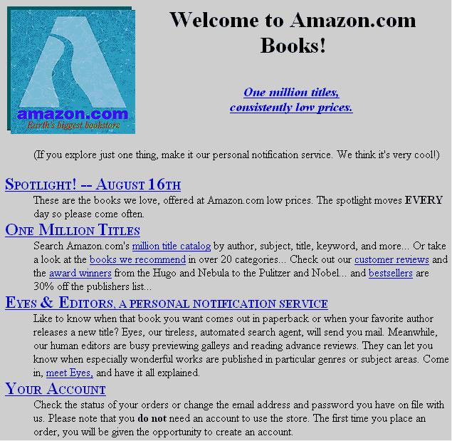
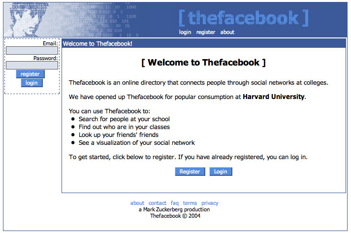
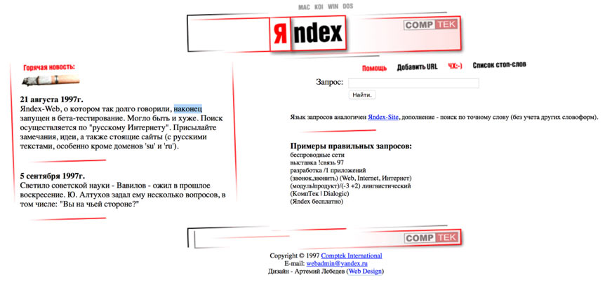
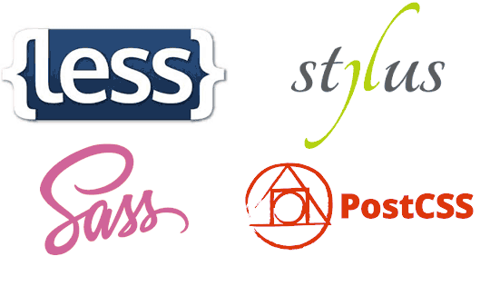
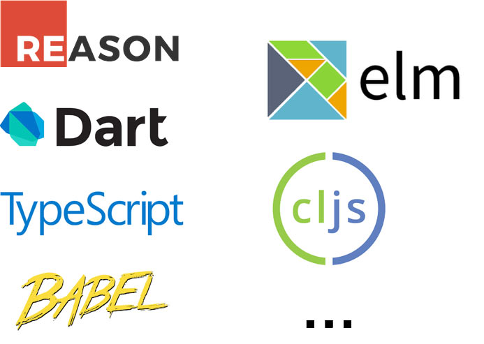
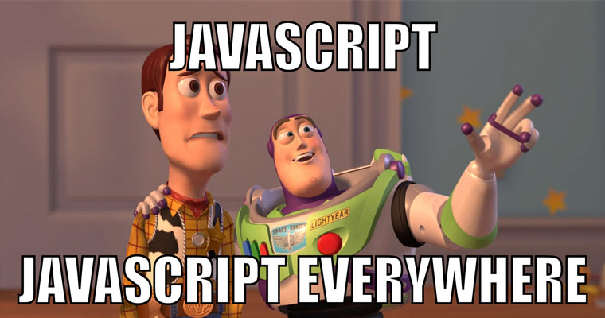
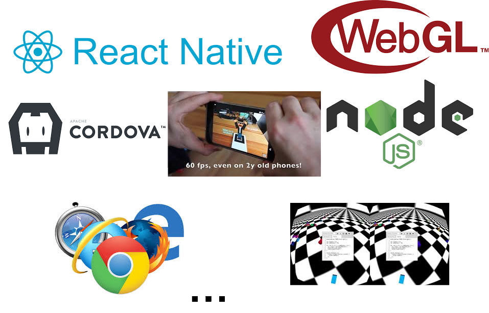

# 1. Введение

## Как появился интернет
[Тим Бернерс-Ли](https://ru.wikipedia.org/wiki/Бернерс-Ли,_Тим), создатель URI, URL, HTTP, HTML, WWW. Короче, придумал Интернет:


Язык HTML изначально был придуман для того, чтобы объединить научные публикации. Текст, ссылки, какие-то картинки и все. Собственно, все придумалось из-за ссылок. Ссылка — это и есть гипертекст, важнейшая часть любого HTML-документа. Никто не предполагал, что из этого получится глобальная сеть, в которой можно покупать, играть в игры, тупить в Ютюб, зависать в соцсетях и пр. То есть HTML был создан не для того, что на нем сейчас делают.

```js
let html = '💩';
```

[Этот компьютер](https://en.wikipedia.org/wiki/NeXT_Computer) стал первым веб-сервером:


Со временем HTML пошел в массы, а массам захотелось добавить красоты. Научным публикациям много не надо: текст, графики, ссылки. А вот когда дело доходит до коммерции или персональных страничек, то тут уже хочется поцветастее, поинтереснее.

Первая версия [Амазона](http://amazon.com):



Первая версия Фейсбука:



[Первая версия Яндекса](https://www.artlebedev.ru/yandex/site/):



И решили, что нужен механизм для изменения цвета текста, шрифта, расположения блоков и пр. Так появился [CSS](https://ru.wikipedia.org/wiki/CSS#.D0.98.D1.81.D1.82.D0.BE.D1.80.D0.B8.D1.8F_.D1.81.D0.BE.D0.B7.D0.B4.D0.B0.D0.BD.D0.B8.D1.8F_.D0.B8_.D1.80.D0.B0.D0.B7.D0.B2.D0.B8.D1.82.D0.B8.D1.8F_CSS).

CSS так же не был рассчитан на все те дизайнерские фантазии, которые со временем становились трендами в веб-дизайне. ни теней, ни скругленных уголков. Даже позиционирование элементов на странице до сих пор вызывает ступор у многих начинающих верстальщиков.

Код в CSS-файлах много раз повторялся, потому что никто даже не думал, что его будет так много. Поддержка сайтов становилась все сложнее и сложнее. Браузеров стало много, каждый мутил что-то свое. Консорциум W3C, который придумали как раз для выработки общих стандартов, не успевал справляться со своими задачами. CSS сильно отстал от нужд рынка и поэтому проблему начали решать разработчики самостоятельно. Так появились CSS-[препроцессоры](https://ru.wikipedia.org/wiki/Препроцессор).



В препроцессоре используется CSS-подобный синтаксис, обогащенный возможностью создавать переменные, функции, циклы и условия. На выходе получаем CSS-файл, который уже отдается браузеру.

Обособлено стоит [PostCSS](http://postcss.org/). Эта штука — основа многих полезных инструментов. Самый полезный — [Autoprefixer](https://autoprefixer.github.io/ru/).

Браузеры часто используют свои [префиксы](http://starhack.ru/vendor-prefixes/) для еще не утвержденных CSS-свойств и расставлять их руками в коде крайне геморно. Автопрефиксер может делать это за нас.

В общем, у нас есть HTML для разметки текста, CSS для его стилизации и обе эти технологии отстают от современных требований. Поэтому нам приходится использовать разные инструменты, типа препроцессоров.

```js
let css = '💩';
```

## Как появился JavaScript
[Джон Маккарти](https://ru.wikipedia.org/wiki/Маккарти,_Джон), создатель языка [Лисп](https://ru.wikipedia.org/wiki/Лисп):


[Брендан Эйх](https://ru.wikipedia.org/wiki/Эйх,_Брендан), создатель [JavaScript](https://ru.wikipedia.org/wiki/JavaScript):


### [Война браузеров](https://ru.wikipedia.org/wiki/Война_браузеров)
Когда бизнес понял, что интернет — это серьезно, первым делом встал вопрос, каким браузером будут пользоваться люди. Сначала в лидерах был [Netscape](https://ru.wikipedia.org/wiki/Netscape_Navigator), потом его подмял Microsoft со своим [Internet Explorer](https://ru.wikipedia.org/wiki/Internet_Explorer).

Когда-то в браузерах вообще нельзя было программировать. Был HTML, чахлый CSS и все. И Netscape, когда им на пятки начал наступать IE, решили что-то сделать. И позвали Брендана, чтобы он им запилил скриптовой язык.

Брендан Эйх плотно занимался Scheme, диалектом Лиспа. Это функциональный язык, где нет объектов, нет классов, но зато все очень хорошо с функциями. Поэтому в JS так развита [функциональная парадигма](https://ru.wikipedia.org/wiki/Функциональное_программирование) и [ООП](https://ru.wikipedia.org/wiki/Объектно-ориентированное_программирование) изначально было довольно экзотическим (пока в ES6 не добавили классы нужно было использовать либо функциональное, либо прототипное наследование).

У Брендона было 10 дней, чтобы подготовить прототип языка. Срок весьма небольшой, поэтому получилось как получилось:


Всегда интересно смотреть записи докладов Брендона на эту тему:

<div class="row">
    <div class="col-md-6">
        <iframe width="560" height="315" src="https://www.youtube.com/embed/-00X6Me-y7U?rel=0&amp;controls=0&amp;showinfo=0" frameborder="0" allowfullscreen></iframe>
    </div>
    <div class="col-md-6">
        <iframe width="560" height="315" src="https://www.youtube.com/embed/ryJSRZzAvUs?rel=0&amp;controls=0&amp;showinfo=0" frameborder="0" allowfullscreen></iframe>
    </div>
</div>
<br>

Язык должен был быть максимально простым, максимально прощать оплошности. То есть создавался он не для программистов, а для всех, кто хочет что-то сделать в браузере. И когда дело дошло до реализации сложных веб-приложений (о которых никто даже не предполагал на момент создания) вылезли разные неприятные моменты.

```js
let js = '💩';
```

[История JavaScript](https://habrahabr.ru/company/livetyping/blog/324196/), очень интересно.

Как и в ситуации с CSS, стандартизация и развитие JS буксовала долгое время. Браузеров много, каждая корпорация тянет одеяло на себя, сложно договориться и родить хороший стандарт, который всех устроит и будет удобен в реализации и использовании. Поэтому опять за дело взялись сами разработчики:



Существует множество языков, которые компилируются в JS. Дизайн этих языков как раз наоборот предназначен для программистов и их стабильность на порядок выше. На данный момент [TypeScript](https://ru.wikipedia.org/wiki/TypeScript) от Микрософт, пожалуй, самый популярный.

## Фронтенд-разработка
Сейчас, чтобы решить задачу (сверстать страничку, запрограммировать какой-то интерфейс) нужно обвешаться препроцессорами, [транспайлерами](https://en.wikipedia.org/wiki/Source-to-source_compiler), настроить сборку и уже потом начать что-то делать. Помимо работы как таковой фронтендщик еще должен со всем этим возиться и это отнимает довольно много времени.

```js
const isShit = technology => technology === '💩';

let frontend = (!isShit(html) && !isShit(css) && !isShit(js)) ? '👍🏻' : '💩';
console.log(frontend); // сами понимаете...
```

Тем не менее, весь этот зоопарк инструментов обеспечивает очень быстрое развитие технологий. Даже без стандартов мы можем использовать современный синтаксис, опробовать его и уже потом утвердить.

Есть и хорошие новости.



Научившись работать с HTML, CSS и JS можно делать много интересных вещей: верстать сайты, программировать логику и поведение интерфейсов в вебе и в приложениях. Браузеры начали поддерживать дополненную и виртуальную реальность. Есть технологии для создания родных приложений для iOS, Android и разных десктопных ОС. И все это JavaScript и сопутствующие технологии.



## Вывод
Современный фронтенд запутанный, сложный, но крайне перспективный и очень интересный.

## Домашнее задание
### Обязательное
* Скачать и установить [PHPStorm](https://www.jetbrains.com/webstorm/download/). Студентам дают бесплатно, нужно только указать ваши ВУЗовские данные.
* Зарегистрироваться на [Хекслете](http://hexlet.io).
* Пройти курс «[Системы контроля версий (GIT)](https://ru.hexlet.io/courses/intro_to_git)».

### Бонус — курсы на Хекслете
* [Введение в веб-разработку](https://ru.hexlet.io/courses/intro_to_web_development).
* [Жизнь программиста](https://ru.hexlet.io/courses/prog-life).
* [Введение в программирование](https://ru.hexlet.io/courses/introduction_to_programming) — особо будет полезно тем, кто только начинает.

